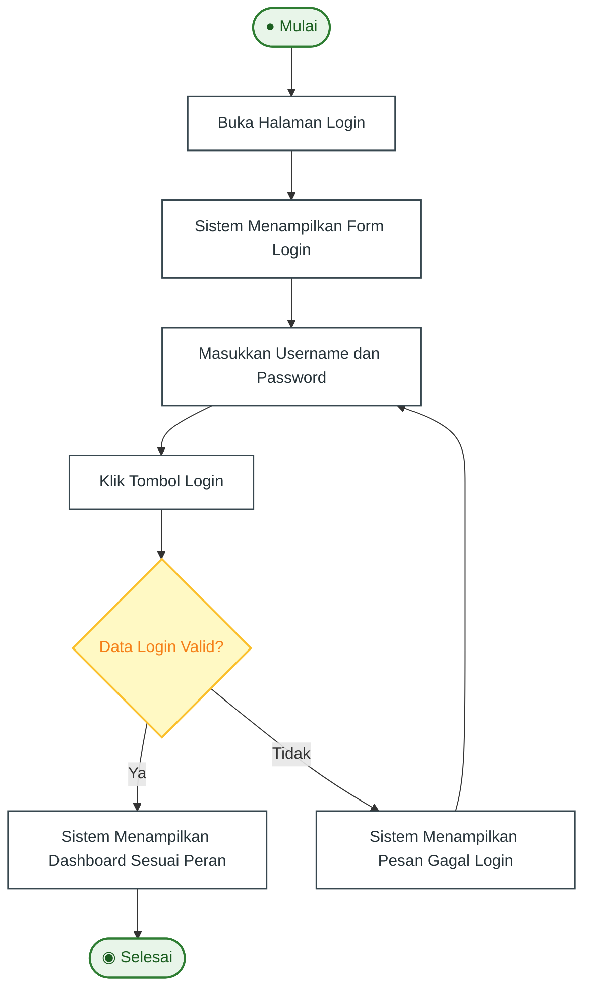

# Activity Diagram: Melakukan Login (SRS 3.3.1)

```mermaid
flowchart TD
    Start([● Mulai]) --> A1[Buka Halaman Login]
    A1 --> S1[Sistem Menampilkan Form Login]
    S1 --> A2[Masukkan Username dan Password]
    A2 --> A3[Klik Tombol Login]
    A3 --> S2{Data Login Valid?}
    
    S2 -->|Ya| S3[Sistem Menampilkan Dashboard Sesuai Peran]
    S3 --> EndNode([◉ Selesai])
    
    S2 -->|Tidak| S4[Sistem Menampilkan Pesan Gagal Login]
    S4 --> A2

    classDef startEnd fill:#E8F5E9,stroke:#2E7D32,stroke-width:2px,color:#1B5E20;
    classDef action fill:#FFFFFF,stroke:#37474F,stroke-width:1.5px,color:#263238;
    classDef decision fill:#FFF9C4,stroke:#FBC02D,stroke-width:2px,color:#F57F17;
    
    class Start,EndNode startEnd;
    class A1,S1,A2,A3,S3,S4 action;
    class S2 decision;
```
