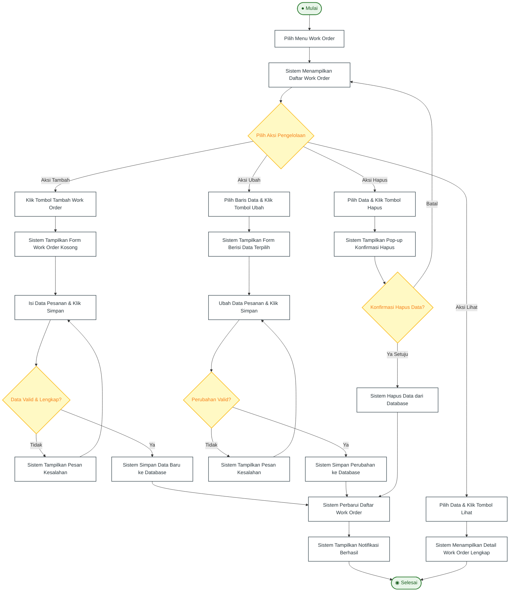

# Activity Diagram: Melakukan CRUD Work Order (SRS 3.3.2)

```mermaid
flowchart TD
    Start([● Mulai]) --> A1[Pilih Menu Work Order]
    A1 --> S1[Sistem Menampilkan Daftar Work Order]
    S1 --> A2{Pilih Aksi Pengelolaan}

    %% Cabang Tambah
    A2 -->|Aksi Tambah| T1[Klik Tombol Tambah Work Order]
    T1 --> T2[Sistem Tampilkan Form Work Order Kosong]
    T2 --> T3[Isi Data Pesanan & Klik Simpan]
    T3 --> T4{Data Valid & Lengkap?}
    T4 -->|Tidak| T5[Sistem Tampilkan Pesan Kesalahan]
    T5 --> T3
    T4 -->|Ya| T6[Sistem Simpan Data Baru ke Database]
    T6 --> T7[Sistem Perbarui Daftar Work Order]
    T7 --> T8[Sistem Tampilkan Notifikasi Berhasil]
    T8 --> EndNode([◉ Selesai])

    %% Cabang Ubah
    A2 -->|Aksi Ubah| U1[Pilih Baris Data & Klik Tombol Ubah]
    U1 --> U2[Sistem Tampilkan Form Berisi Data Terpilih]
    U2 --> U3[Ubah Data Pesanan & Klik Simpan]
    U3 --> U4{Perubahan Valid?}
    U4 -->|Tidak| U5[Sistem Tampilkan Pesan Kesalahan]
    U5 --> U3
    U4 -->|Ya| U6[Sistem Simpan Perubahan ke Database]
    U6 --> T7

    %% Cabang Hapus
    A2 -->|Aksi Hapus| H1[Pilih Data & Klik Tombol Hapus]
    H1 --> H2[Sistem Tampilkan Pop-up Konfirmasi Hapus]
    H2 --> H3{Konfirmasi Hapus Data?}
    H3 -->|Batal| S1
    H3 -->|Ya Setuju| H4[Sistem Hapus Data dari Database]
    H4 --> T7

    %% Cabang Lihat
    A2 -->|Aksi Lihat| L1[Pilih Data & Klik Tombol Lihat]
    L1 --> L2[Sistem Menampilkan Detail Work Order Lengkap]
    L2 --> EndNode

    classDef startEnd fill:#E8F5E9,stroke:#2E7D32,stroke-width:2px,color:#1B5E20;
    classDef action fill:#FFFFFF,stroke:#37474F,stroke-width:1.5px,color:#263238;
    classDef decision fill:#FFF9C4,stroke:#FBC02D,stroke-width:2px,color:#F57F17;
    
    class Start,EndNode startEnd;
    class A1,S1,T1,T2,T3,T5,T6,T7,T8,U1,U2,U3,U5,U6,H1,H2,H4,L1,L2 action;
    class A2,T4,U4,H3 decision;
```
