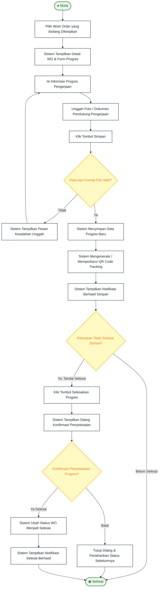

# Activity Diagram: Mengelola Progress (SRS 3.3.3)

```mermaid
flowchart TD
    Start([● Mulai]) --> P1[Pilih Work Order yang Sedang Dikerjakan]
    P1 --> S1[Sistem Tampilkan Detail WO & Form Progres]
    S1 --> P2[Isi Informasi Progres Pengerjaan]
    P2 --> P3[Unggah Foto / Dokumen Pendukung Pengerjaan]
    P3 --> P4[Klik Tombol Simpan]
    P4 --> S2{Data dan Format File Valid?}
    
    S2 -->|Tidak| S3[Sistem Tampilkan Pesan Kesalahan Unggah]
    S3 --> P2
    
    S2 -->|Ya| S4[Sistem Menyimpan Data Progres Baru]
    S4 --> S5[Sistem Mengenerate / Memperbarui QR Code Tracking]
    S5 --> S6[Sistem Tampilkan Notifikasi Berhasil Simpan]
    S6 --> P5{Pekerjaan Telah Selesai Semua?}

    P5 -->|Belum Selesai| EndNode([◉ Selesai])
    
    P5 -->|Ya, Tandai Selesai| P6[Klik Tombol Selesaikan Progres]
    P6 --> S7[Sistem Tampilkan Dialog Konfirmasi Penyelesaian]
    S7 --> P7{Konfirmasi Penyelesaian Progres?}
    
    P7 -->|Batal| S8[Tutup Dialog & Pertahankan Status Sebelumnya]
    S8 --> EndNode
    
    P7 -->|Ya Selesai| S9[Sistem Ubah Status WO Menjadi Selesai]
    S9 --> S10[Sistem Tampilkan Notifikasi Selesai Berhasil]
    S10 --> EndNode

    classDef startEnd fill:#E8F5E9,stroke:#2E7D32,stroke-width:2px,color:#1B5E20;
    classDef action fill:#FFFFFF,stroke:#37474F,stroke-width:1.5px,color:#263238;
    classDef decision fill:#FFF9C4,stroke:#FBC02D,stroke-width:2px,color:#F57F17;
    
    class Start,EndNode startEnd;
    class P1,S1,P2,P3,P4,S3,S4,S5,S6,P6,S7,S8,S9,S10 action;
    class S2,P5,P7 decision;
```
