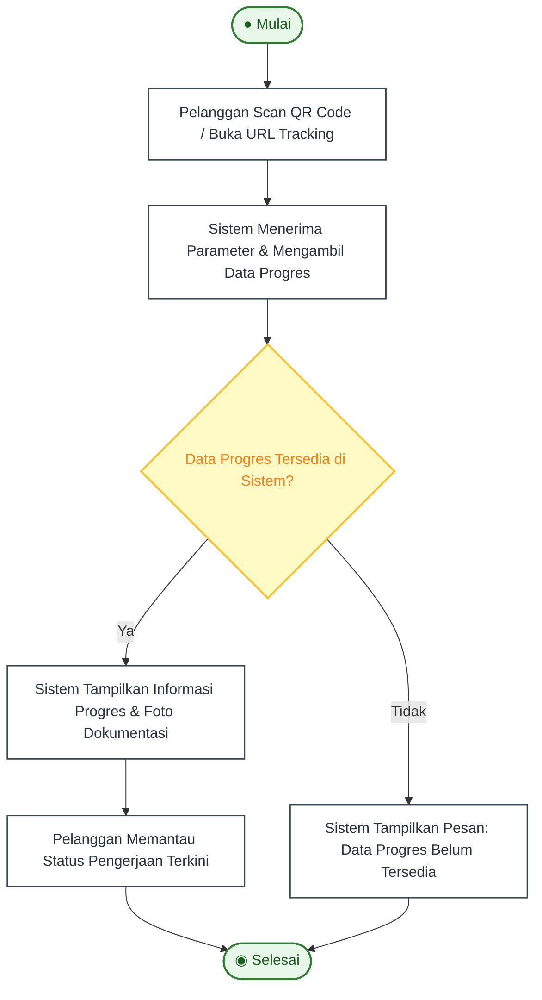

# Activity Diagram: Melihat Progress (Pelanggan) (SRS 3.3.4)

```mermaid
flowchart TD
    Start([● Mulai]) --> C1[Pelanggan Scan QR Code / Buka URL Tracking]
    C1 --> S1[Sistem Menerima Parameter & Mengambil Data Progres]
    S1 --> S2{Data Progres Tersedia di Sistem?}
    
    S2 -->|Ya| S3[Sistem Tampilkan Informasi Progres & Foto Dokumentasi]
    S3 --> C2[Pelanggan Memantau Status Pengerjaan Terkini]
    C2 --> EndNode([◉ Selesai])
    
    S2 -->|Tidak| S4[Sistem Tampilkan Pesan: Data Progres Belum Tersedia]
    S4 --> EndNode

    classDef startEnd fill:#E8F5E9,stroke:#2E7D32,stroke-width:2px,color:#1B5E20;
    classDef action fill:#FFFFFF,stroke:#37474F,stroke-width:1.5px,color:#263238;
    classDef decision fill:#FFF9C4,stroke:#FBC02D,stroke-width:2px,color:#F57F17;
    
    class Start,EndNode startEnd;
    class C1,S1,S3,C2,S4 action;
    class S2 decision;
```
