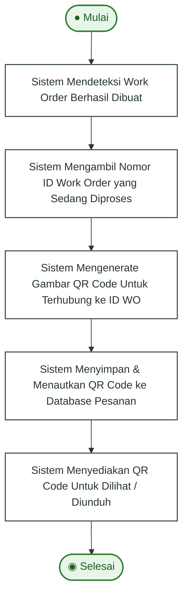

# Activity Diagram: Mengenerate QR (Inklusi Otomatis Work Order) (SRS 3.3.6)

```mermaid
flowchart TD
    Start([● Mulai]) --> S1[Sistem Mendeteksi Work Order Berhasil Dibuat]
    S1 --> S2[Sistem Mengambil Nomor ID Work Order yang Sedang Diproses]
    S2 --> S3[Sistem Mengenerate Gambar QR Code Untuk Terhubung ke ID WO]
    S3 --> S4[Sistem Menyimpan & Menautkan QR Code ke Database Pesanan]
    S4 --> S5[Sistem Menyediakan QR Code Untuk Dilihat / Diunduh]
    S5 --> EndNode([◉ Selesai])

    classDef startEnd fill:#E8F5E9,stroke:#2E7D32,stroke-width:2px,color:#1B5E20;
    classDef action fill:#FFFFFF,stroke:#37474F,stroke-width:1.5px,color:#263238;
    
    class Start,EndNode startEnd;
    class S1,S2,S3,S4,S5 action;
```
