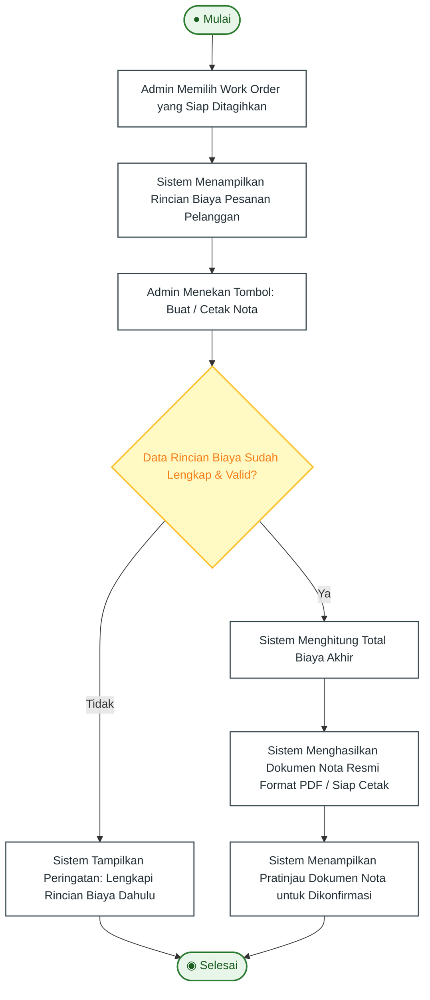

# Activity Diagram: Membuat Nota Pembayaran (SRS 3.3.7)

```mermaid
flowchart TD
    Start([● Mulai]) --> A1[Admin Memilih Work Order yang Siap Ditagihkan]
    A1 --> S1[Sistem Menampilkan Rincian Biaya Pesanan Pelanggan]
    S1 --> A2[Admin Menekan Tombol: Buat / Cetak Nota]
    A2 --> S2{Data Rincian Biaya Sudah Lengkap & Valid?}
    
    S2 -->|Tidak| S3[Sistem Tampilkan Peringatan: Lengkapi Rincian Biaya Dahulu]
    S3 --> EndNode([◉ Selesai])
    
    S2 -->|Ya| S4[Sistem Menghitung Total Biaya Akhir]
    S4 --> S5[Sistem Menghasilkan Dokumen Nota Resmi Format PDF / Siap Cetak]
    S5 --> S6[Sistem Menampilkan Pratinjau Dokumen Nota untuk Dikonfirmasi]
    S6 --> EndNode

    classDef startEnd fill:#E8F5E9,stroke:#2E7D32,stroke-width:2px,color:#1B5E20;
    classDef action fill:#FFFFFF,stroke:#37474F,stroke-width:1.5px,color:#263238;
    classDef decision fill:#FFF9C4,stroke:#FBC02D,stroke-width:2px,color:#F57F17;
    
    class Start,EndNode startEnd;
    class A1,S1,A2,S3,S4,S5,S6 action;
    class S2 decision;
```
