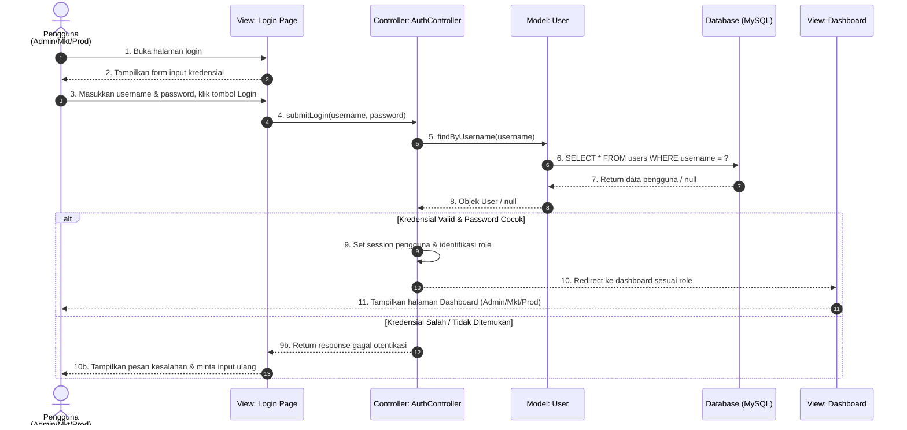

# Sequence Diagram: Melakukan Login (SRS 3.2.1)

```mermaid
sequenceDiagram
    autonumber
    actor Pengguna as Pengguna<br/>(Admin/Mkt/Prod)
    participant LoginUI as View: Login Page
    participant AuthCtrl as Controller: AuthController
    participant UserModel as Model: User
    participant DB as Database (MySQL)
    participant DashUI as View: Dashboard

    Pengguna->>LoginUI: 1. Buka halaman login
    LoginUI-->>Pengguna: 2. Tampilkan form input kredensial
    Pengguna->>LoginUI: 3. Masukkan username & password, klik tombol Login
    LoginUI->>AuthCtrl: 4. submitLogin(username, password)
    AuthCtrl->>UserModel: 5. findByUsername(username)
    UserModel->>DB: 6. SELECT * FROM users WHERE username = ?
    DB-->>UserModel: 7. Return data pengguna / null
    UserModel-->>AuthCtrl: 8. Objek User / null

    alt Kredensial Valid & Password Cocok
        AuthCtrl->>AuthCtrl: 9. Set session pengguna & identifikasi role
        AuthCtrl-->>DashUI: 10. Redirect ke dashboard sesuai role
        DashUI-->>Pengguna: 11. Tampilkan halaman Dashboard (Admin/Mkt/Prod)
    else Kredensial Salah / Tidak Ditemukan
        AuthCtrl-->>LoginUI: 9b. Return response gagal otentikasi
        LoginUI-->>Pengguna: 10b. Tampilkan pesan kesalahan & minta input ulang
    end
```
