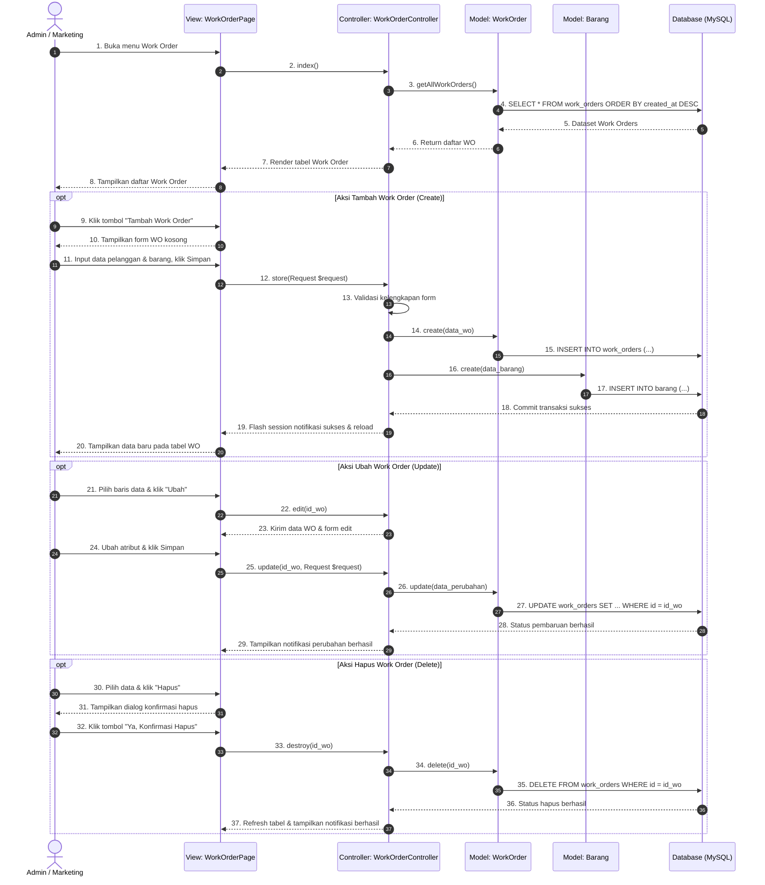

# Sequence Diagram: Melakukan CRUD Work Order (SRS 3.2.2)

```mermaid
sequenceDiagram
    autonumber
    actor Staf as Admin / Marketing
    participant WOUI as View: WorkOrderPage
    participant WOCtrl as Controller: WorkOrderController
    participant WOModel as Model: WorkOrder
    participant BarangModel as Model: Barang
    participant DB as Database (MySQL)

    %% Aksi Menampilkan Daftar
    Staf->>WOUI: 1. Buka menu Work Order
    WOUI->>WOCtrl: 2. index()
    WOCtrl->>WOModel: 3. getAllWorkOrders()
    WOModel->>DB: 4. SELECT * FROM work_orders ORDER BY created_at DESC
    DB-->>WOModel: 5. Dataset Work Orders
    WOModel-->>WOCtrl: 6. Return daftar WO
    WOCtrl-->>WOUI: 7. Render tabel Work Order
    WOUI-->>Staf: 8. Tampilkan daftar Work Order

    %% Sub-skenario: Tambah Data Baru
    opt Aksi Tambah Work Order (Create)
        Staf->>WOUI: 9. Klik tombol "Tambah Work Order"
        WOUI-->>Staf: 10. Tampilkan form WO kosong
        Staf->>WOUI: 11. Input data pelanggan & barang, klik Simpan
        WOUI->>WOCtrl: 12. store(Request $request)
        WOCtrl->>WOCtrl: 13. Validasi kelengkapan form
        WOCtrl->>WOModel: 14. create(data_wo)
        WOModel->>DB: 15. INSERT INTO work_orders (...)
        WOCtrl->>BarangModel: 16. create(data_barang)
        BarangModel->>DB: 17. INSERT INTO barang (...)
        DB-->>WOCtrl: 18. Commit transaksi sukses
        WOCtrl-->>WOUI: 19. Flash session notifikasi sukses & reload
        WOUI-->>Staf: 20. Tampilkan data baru pada tabel WO
    end

    %% Sub-skenario: Ubah Data
    opt Aksi Ubah Work Order (Update)
        Staf->>WOUI: 21. Pilih baris data & klik "Ubah"
        WOUI->>WOCtrl: 22. edit(id_wo)
        WOCtrl-->>WOUI: 23. Kirim data WO & form edit
        Staf->>WOUI: 24. Ubah atribut & klik Simpan
        WOUI->>WOCtrl: 25. update(id_wo, Request $request)
        WOCtrl->>WOModel: 26. update(data_perubahan)
        WOModel->>DB: 27. UPDATE work_orders SET ... WHERE id = id_wo
        DB-->>WOCtrl: 28. Status pembaruan berhasil
        WOCtrl-->>WOUI: 29. Tampilkan notifikasi perubahan berhasil
    end

    %% Sub-skenario: Hapus Data
    opt Aksi Hapus Work Order (Delete)
        Staf->>WOUI: 30. Pilih data & klik "Hapus"
        WOUI-->>Staf: 31. Tampilkan dialog konfirmasi hapus
        Staf->>WOUI: 32. Klik tombol "Ya, Konfirmasi Hapus"
        WOUI->>WOCtrl: 33. destroy(id_wo)
        WOCtrl->>WOModel: 34. delete(id_wo)
        WOModel->>DB: 35. DELETE FROM work_orders WHERE id = id_wo
        DB-->>WOCtrl: 36. Status hapus berhasil
        WOCtrl-->>WOUI: 37. Refresh tabel & tampilkan notifikasi berhasil
    end
```
