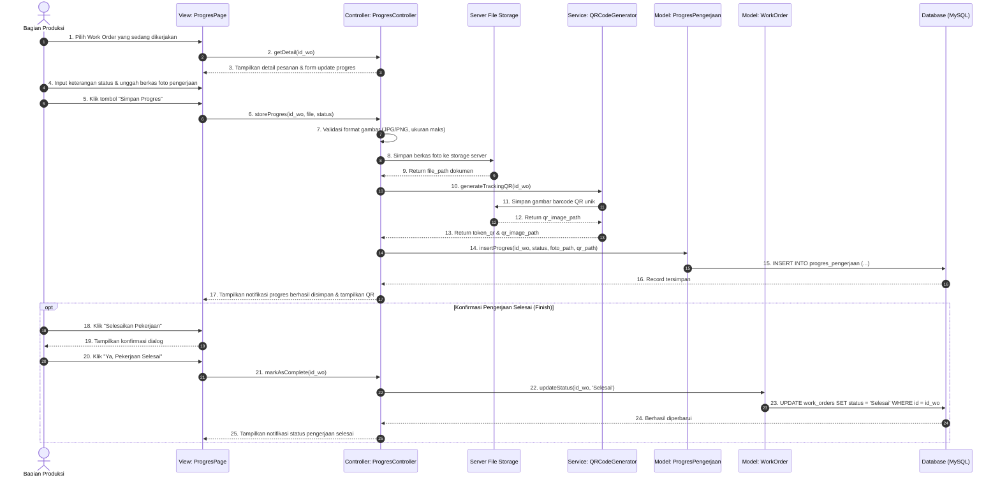

# Sequence Diagram: Mengelola Progress & Auto Generate QR Code (SRS 3.2.3 & 3.2.6)

```mermaid
sequenceDiagram
    autonumber
    actor Prod as Bagian Produksi
    participant ProgUI as View: ProgresPage
    participant ProgCtrl as Controller: ProgresController
    participant FileStorage as Server File Storage
    participant QRService as Service: QRCodeGenerator
    participant ProgModel as Model: ProgresPengerjaan
    participant WOModel as Model: WorkOrder
    participant DB as Database (MySQL)

    Prod->>ProgUI: 1. Pilih Work Order yang sedang dikerjakan
    ProgUI->>ProgCtrl: 2. getDetail(id_wo)
    ProgCtrl-->>ProgUI: 3. Tampilkan detail pesanan & form update progres
    Prod->>ProgUI: 4. Input keterangan status & unggah berkas foto pengerjaan
    Prod->>ProgUI: 5. Klik tombol "Simpan Progres"
    ProgUI->>ProgCtrl: 6. storeProgres(id_wo, file, status)
    
    ProgCtrl->>ProgCtrl: 7. Validasi format gambar (JPG/PNG, ukuran maks)
    ProgCtrl->>FileStorage: 8. Simpan berkas foto ke storage server
    FileStorage-->>ProgCtrl: 9. Return file_path dokumen
    
    ProgCtrl->>QRService: 10. generateTrackingQR(id_wo)
    QRService->>FileStorage: 11. Simpan gambar barcode QR unik
    FileStorage-->>QRService: 12. Return qr_image_path
    QRService-->>ProgCtrl: 13. Return token_qr & qr_image_path
    
    ProgCtrl->>ProgModel: 14. insertProgres(id_wo, status, foto_path, qr_path)
    ProgModel->>DB: 15. INSERT INTO progres_pengerjaan (...)
    DB-->>ProgCtrl: 16. Record tersimpan
    
    ProgCtrl-->>ProgUI: 17. Tampilkan notifikasi progres berhasil disimpan & tampilkan QR
    
    opt Konfirmasi Pengerjaan Selesai (Finish)
        Prod->>ProgUI: 18. Klik "Selesaikan Pekerjaan"
        ProgUI-->>Prod: 19. Tampilkan konfirmasi dialog
        Prod->>ProgUI: 20. Klik "Ya, Pekerjaan Selesai"
        ProgUI->>ProgCtrl: 21. markAsComplete(id_wo)
        ProgCtrl->>WOModel: 22. updateStatus(id_wo, 'Selesai')
        WOModel->>DB: 23. UPDATE work_orders SET status = 'Selesai' WHERE id = id_wo
        DB-->>ProgCtrl: 24. Berhasil diperbarui
        ProgCtrl-->>ProgUI: 25. Tampilkan notifikasi status pengerjaan selesai
    end
```
