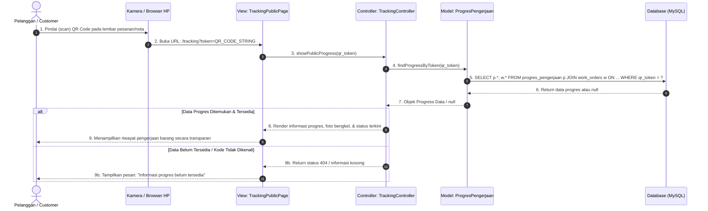

# Sequence Diagram: Melihat Progress (Pelanggan / Public Tracking) (SRS 3.2.4)

```mermaid
sequenceDiagram
    autonumber
    actor Pelanggan as Pelanggan / Customer
    participant Kamera as Kamera / Browser HP
    participant TrackUI as View: TrackingPublicPage
    participant TrackCtrl as Controller: TrackingController
    participant ProgModel as Model: ProgresPengerjaan
    participant DB as Database (MySQL)

    Pelanggan->>Kamera: 1. Pindai (scan) QR Code pada lembar pesanan/nota
    Kamera->>TrackUI: 2. Buka URL: /tracking?token=QR_CODE_STRING
    TrackUI->>TrackCtrl: 3. showPublicProgress(qr_token)
    TrackCtrl->>ProgModel: 4. findProgressByToken(qr_token)
    ProgModel->>DB: 5. SELECT p.*, w.* FROM progres_pengerjaan p JOIN work_orders w ON ... WHERE qr_token = ?
    DB-->>ProgModel: 6. Return data progres atau null
    ProgModel-->>TrackCtrl: 7. Objek Progress Data / null

    alt Data Progres Ditemukan & Tersedia
        TrackCtrl-->>TrackUI: 8. Render informasi progres, foto bengkel, & status terkini
        TrackUI-->>Pelanggan: 9. Menampilkan riwayat pengerjaan barang secara transparan
    else Data Belum Tersedia / Kode Tidak Dikenali
        TrackCtrl-->>TrackUI: 8b. Return status 404 / informasi kosong
        TrackUI-->>Pelanggan: 9b. Tampilkan pesan: "Informasi progres belum tersedia"
    end
```
