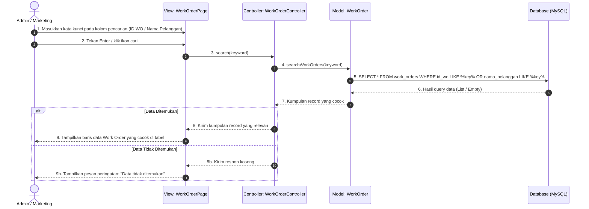

# Sequence Diagram: Mencari Work Order (SRS 3.2.5)

```mermaid
sequenceDiagram
    autonumber
    actor Staf as Admin / Marketing
    participant WOUI as View: WorkOrderPage
    participant WOCtrl as Controller: WorkOrderController
    participant WOModel as Model: WorkOrder
    participant DB as Database (MySQL)

    Staf->>WOUI: 1. Masukkan kata kunci pada kolom pencarian (ID WO / Nama Pelanggan)
    Staf->>WOUI: 2. Tekan Enter / klik ikon cari
    WOUI->>WOCtrl: 3. search(keyword)
    WOCtrl->>WOModel: 4. searchWorkOrders(keyword)
    WOModel->>DB: 5. SELECT * FROM work_orders WHERE id_wo LIKE %key% OR nama_pelanggan LIKE %key%
    DB-->>WOModel: 6. Hasil query data (List / Empty)
    WOModel-->>WOCtrl: 7. Kumpulan record yang cocok

    alt Data Ditemukan
        WOCtrl-->>WOUI: 8. Kirim kumpulan record yang relevan
        WOUI-->>Staf: 9. Tampilkan baris data Work Order yang cocok di tabel
    else Data Tidak Ditemukan
        WOCtrl-->>WOUI: 8b. Kirim respon kosong
        WOUI-->>Staf: 9b. Tampilkan pesan peringatan: "Data tidak ditemukan"
    end
```
