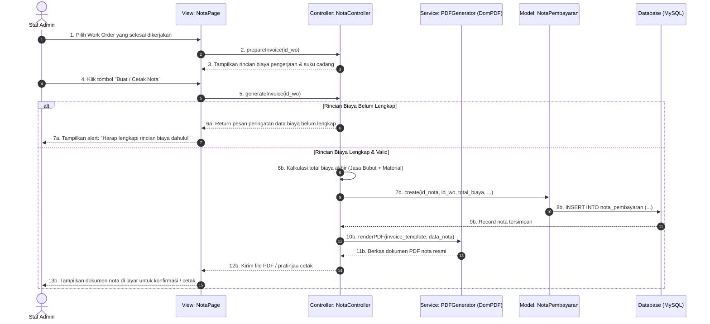

# Sequence Diagram: Membuat Nota Pembayaran (SRS 3.2.7)

```mermaid
sequenceDiagram
    autonumber
    actor Admin as Staf Admin
    participant NotaUI as View: NotaPage
    participant NotaCtrl as Controller: NotaController
    participant PDFService as Service: PDFGenerator (DomPDF)
    participant NotaModel as Model: NotaPembayaran
    participant DB as Database (MySQL)

    Admin->>NotaUI: 1. Pilih Work Order yang selesai dikerjakan
    NotaUI->>NotaCtrl: 2. prepareInvoice(id_wo)
    NotaCtrl-->>NotaUI: 3. Tampilkan rincian biaya pengerjaan & suku cadang
    Admin->>NotaUI: 4. Klik tombol "Buat / Cetak Nota"
    NotaUI->>NotaCtrl: 5. generateInvoice(id_wo)

    alt Rincian Biaya Belum Lengkap
        NotaCtrl-->>NotaUI: 6a. Return pesan peringatan data biaya belum lengkap
        NotaUI-->>Admin: 7a. Tampilkan alert: "Harap lengkapi rincian biaya dahulu!"
    else Rincian Biaya Lengkap & Valid
        NotaCtrl->>NotaCtrl: 6b. Kalkulasi total biaya akhir (Jasa Bubut + Material)
        NotaCtrl->>NotaModel: 7b. create(id_nota, id_wo, total_biaya, ...)
        NotaModel->>DB: 8b. INSERT INTO nota_pembayaran (...)
        DB-->>NotaCtrl: 9b. Record nota tersimpan
        
        NotaCtrl->>PDFService: 10b. renderPDF(invoice_template, data_nota)
        PDFService-->>NotaCtrl: 11b. Berkas dokumen PDF nota resmi
        
        NotaCtrl-->>NotaUI: 12b. Kirim file PDF / pratinjau cetak
        NotaUI-->>Admin: 13b. Tampilkan dokumen nota di layar untuk konfirmasi / cetak
    end
```
